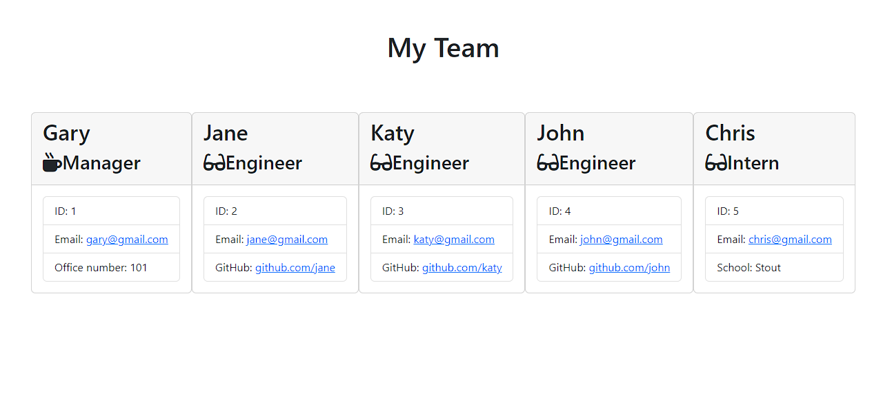

# Team Profile Generator

## Project Summary

The goal of this assignment was to build a Node.js command-line application that prompts the manager to input information about their employees on their software engineering team, then generates an HTML webpage that displays summaries for each person. Then create unit tests to make sure all of our code works. We also  needed to intall Inquire for command-line interface and Jest for testing.

### Here is the link to the final version of the project.

<!-- add link to walk through video 
      -that shows all 4 tests passing 
      -how a user would invoke the application from the command line
      -how a user would enter responses to all of the prompts in the application -demonstrate a generated HTML file that matches the user input-->

### Here is a link to a sample HTML file created by the generator.

[Click here to view a sample HTML file created by the generator.](/homework/team-profile-gen/dist/team.html)

<!-- add tests using jest -->

<!-- add styling -->

